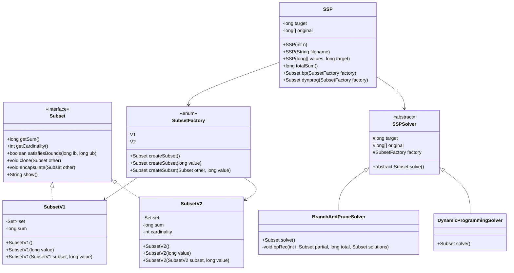
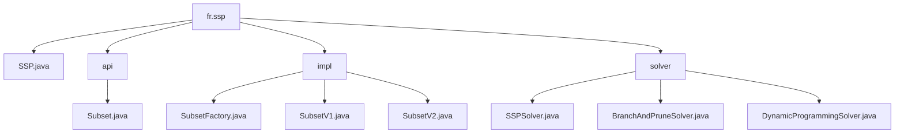
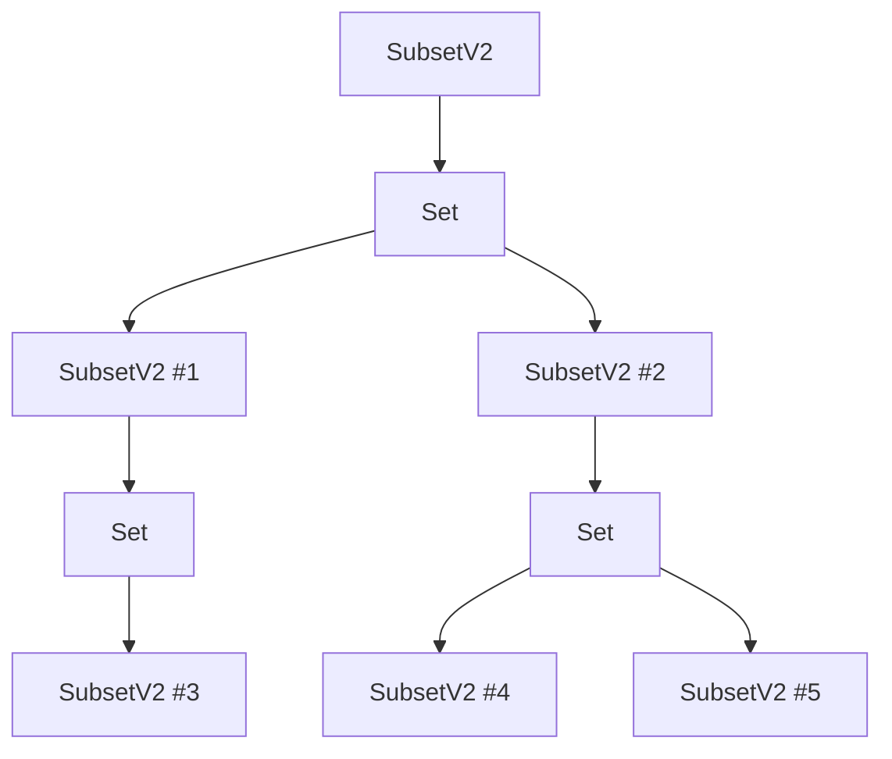
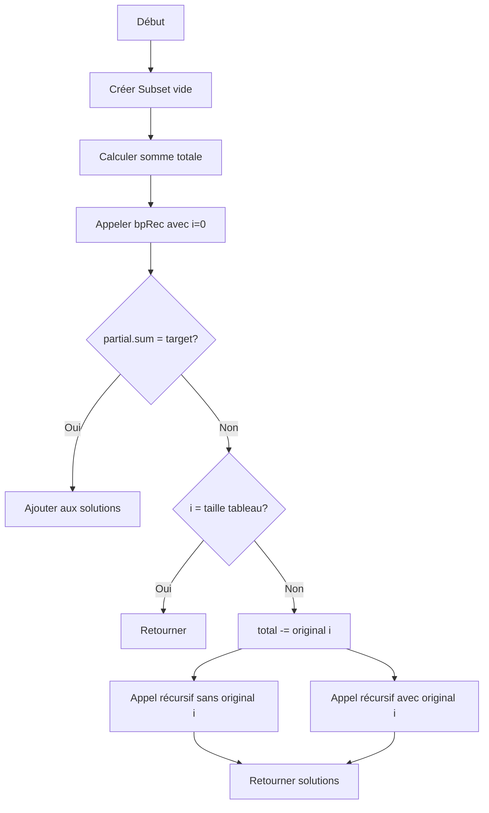
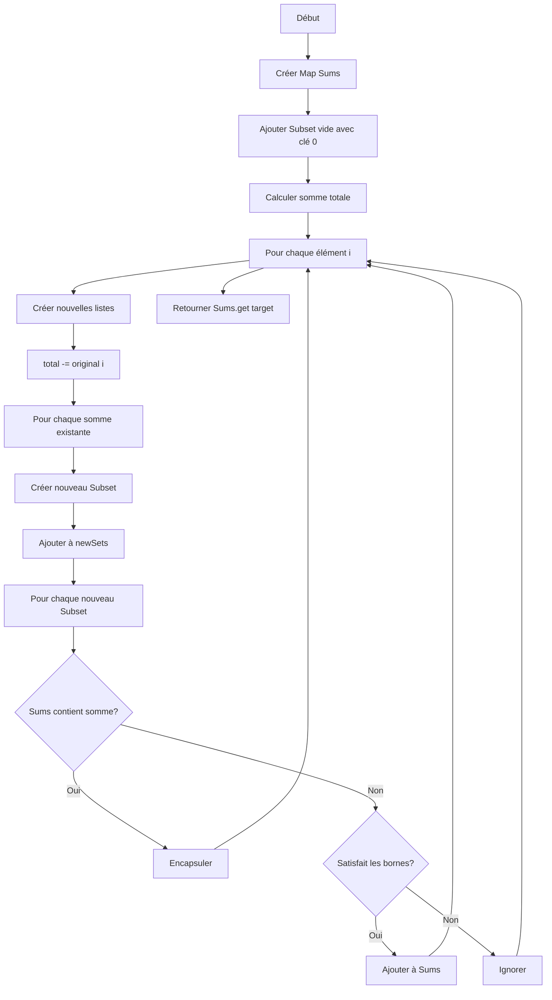
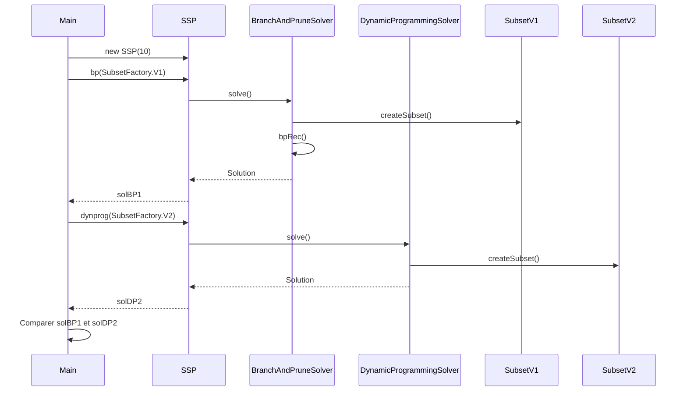

# Projet Subset Sum Problem (SSP)

## Description du Problème

Le problème de la somme de sous-ensembles (Subset Sum Problem ou SSP) est un problème classique d'informatique : étant donné un ensemble d'entiers et une valeur cible, trouver un ou plusieurs sous-ensembles dont la somme est égale à la valeur cible.

## Structure du Projet



## Organisation des Packages



## Implémentations de Subset

Le projet propose deux implémentations différentes de l'interface `Subset` :

### SubsetV1

- Basée sur `Set<HashSet<Long>>`
- Chaque HashSet représente un sous-ensemble d'entiers dont la somme est égale à la cible
- Simple à comprendre et à manipuler

| Structure            | Description                                        |
| -------------------- | -------------------------------------------------- |
| `SubsetV1`           | Classe principale contenant un ensemble de HashSet |
| `Set<HashSet<Long>>` | Collection de sous-ensembles d'entiers             |
| `HashSet<Long> #1`   | Premier sous-ensemble (ex: {1, 2, 5})              |
| `HashSet<Long> #2`   | Deuxième sous-ensemble (ex: {3, 5})                |
| `HashSet<Long> #n`   | Autres sous-ensembles possibles                    |

### SubsetV2

- Structure récursive utilisant `Set<SubsetV2>`
- Chaque sous-ensemble contient des références à d'autres sous-ensembles
- Plus complexe mais potentiellement plus efficace pour certaines opérations



## Algorithmes de Résolution

### Branch and Prune (bp)



### Programmation Dynamique (dynprog)



## Comparaison des Approches

### Structures de données

| Aspect         | SubsetV1                    | SubsetV2                        |
| -------------- | --------------------------- | ------------------------------- |
| Représentation | Simple et directe           | Récursive et complexe           |
| Opérations     | Directes sur les ensembles  | Via des références              |
| Mémoire        | Potentiellement gourmande   | Plus efficace                   |
| Débogage       | Facile                      | Plus complexe                   |
| Performance    | Bonne pour petits ensembles | Meilleure pour grands ensembles |

### Algorithmes

| Aspect      | Branch and Prune               | Programmation Dynamique             |
| ----------- | ------------------------------ | ----------------------------------- |
| Complexité  | O(2^n) dans le pire cas        | O(n \* somme_totale)                |
| Efficacité  | Bonne pour petites instances   | Stable pour instances moyennes      |
| Mémoire     | Moins gourmand                 | Peut nécessiter beaucoup de mémoire |
| Cas d'usage | Solutions proches de la racine | Problèmes généraux                  |

## Utilisation

```java
// Créer une instance SSP (taille 10)
SSP ssp = new SSP(10);

// Résoudre avec Branch and Prune en utilisant SubsetV1
Subset solBP1 = ssp.bp(SubsetFactory.V1);

// Résoudre avec programmation dynamique en utilisant SubsetV2
Subset solDP2 = ssp.dynprog(SubsetFactory.V2);

// Afficher les résultats
System.out.println(solBP1.show());
System.out.println(solDP2.show());

// Comparer les résultats
System.out.println("Les solutions sont identiques : " + solBP1.equals(solDP2));
```

## Exécution du Programme Principal



## Analyse Comparative

### Avantages de SubsetV1

- Représentation plus simple et intuitive
- Opérations directes sur les ensembles d'entiers
- Facilité de débogage et compréhension

### Avantages de SubsetV2

- Structure récursive qui peut être plus efficace en mémoire
- Meilleure performance pour certaines opérations comme `contains` et `encapsulate`
- Potentiellement plus adaptée aux grands ensembles de données

### Comparaison des algorithmes

- Branch and Prune:
  - Plus efficace pour les petites instances ou celles où la solution est proche de la racine de l'arbre de recherche
  - Peut être très inefficace pour les grandes instances
- Programmation Dynamique:
  - Plus stable en termes de performance
  - Efficace pour des instances de taille moyenne
  - Peut nécessiter beaucoup de mémoire pour de grandes valeurs cibles

## Extensions Possibles

- Implémentation parallèle des algorithmes
- Optimisations supplémentaires (heuristiques, structures de données plus efficaces)
- Interface graphique pour visualiser les solutions et comparer les performances
- Adaptation pour traiter des instances très grandes avec des techniques d'approximation

## Conclusion

Ce projet démontre deux approches différentes pour résoudre le problème de la somme de sous-ensembles, ainsi que deux implémentations distinctes de la structure de données pour représenter les sous-ensembles. La comparaison des performances montre que chaque approche a ses avantages selon le contexte d'utilisation.
